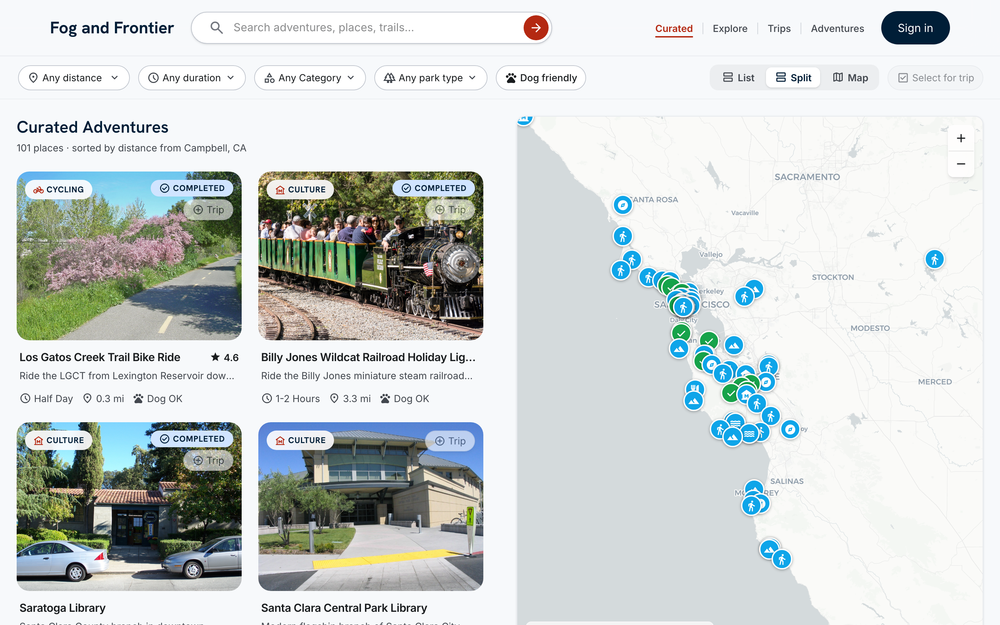
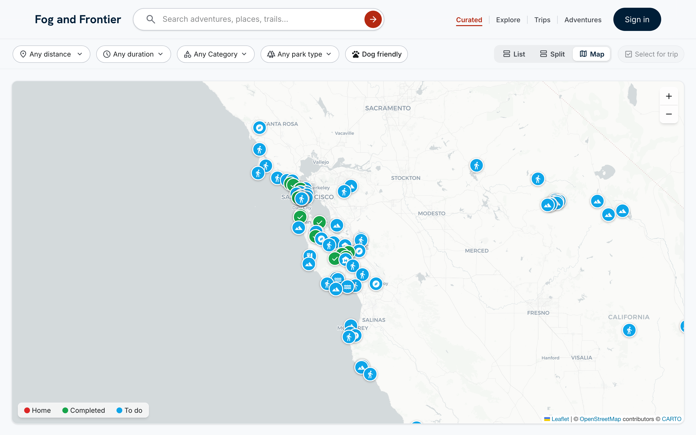
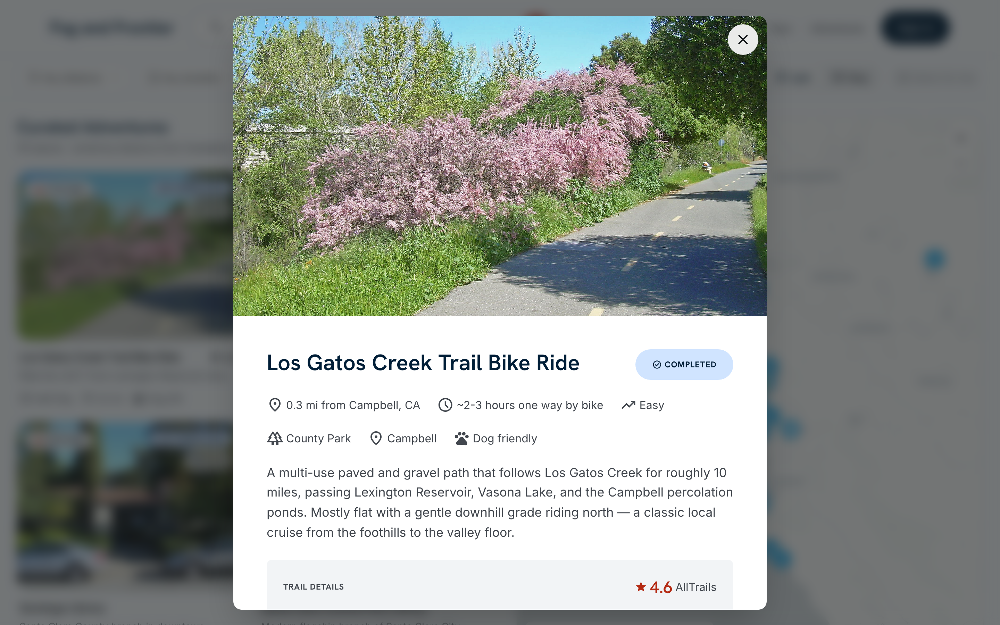
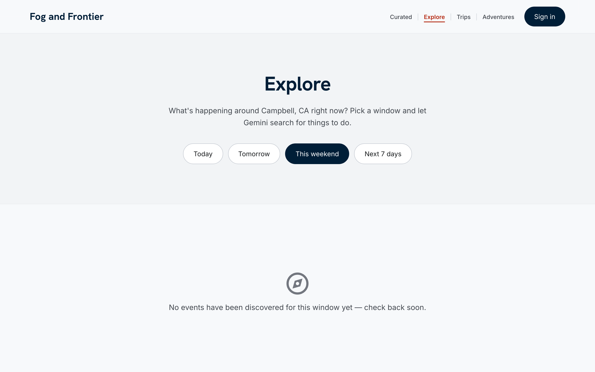
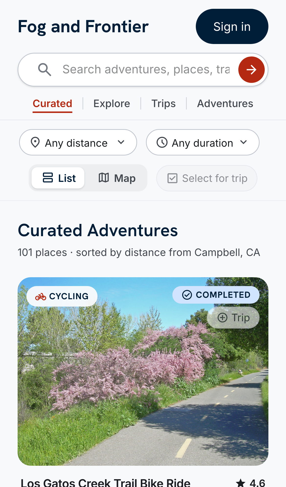
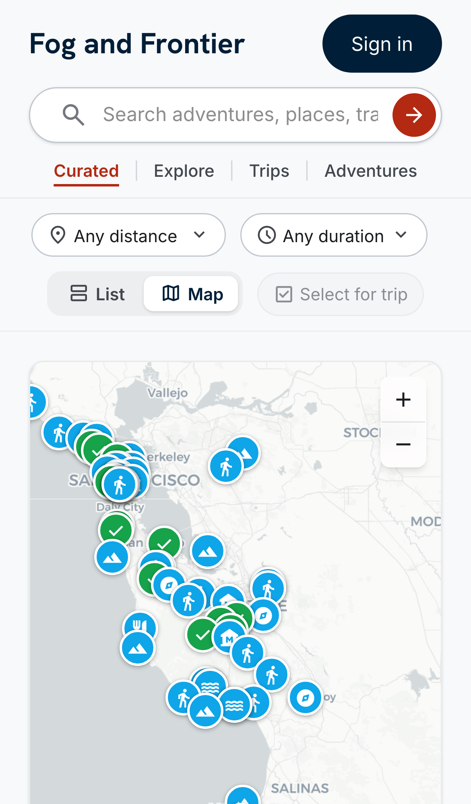

# Fog & Frontier

**A full-stack map-based tracker for Bay Area adventures — hikes, food, scenic
drives, and culture — with collaborative trip planning and AI-assisted
discovery.**

🌉 **Live demo: [fog-and-frontier.vercel.app](https://fog-and-frontier.vercel.app)**

React 19 + Vite front end · a single consolidated Apollo GraphQL serverless
function · Turso (libSQL) edge database · Clerk auth · Leaflet maps · Sentry
observability · Vitest + Playwright in CI.



## What it does

Fog & Frontier is a curated catalog of Bay Area outdoor activities you can browse,
map, filter, and plan trips around.

- **Browse & filter** a catalog of curated adventures — filter by distance from
  home, duration, category (hiking, cycling, water, food, culture, scenic,
  climbing, camping), park designation, and dog-friendliness. Results are sorted
  by distance.
- **Three synced views** — a segmented **List · Split · Map** toggle. Split view
  puts the catalog next to a live map; panning/zooming narrows the list to
  what's in view ("Showing N in this area"), and hovering a card highlights its
  map pin and vice-versa.
- **Interactive map** — Leaflet with a CARTO Positron basemap and custom circular
  glyph pins colored by completion status (to-do / completed) and iconed by
  category.
- **Activity detail** — rich detail cards with AllTrails ratings, trail
  stats, park type, and per-activity user photo uploads.
- **Trip planning** — create a trip, invite members, shortlist activities, and
  **vote**; trips move through a `voting → planning → past` lifecycle with a
  day-by-day itinerary (day index, start time, ordering).
- **AI discovery ("Explore")** — pick a date window (today / tomorrow / this
  weekend / next 7 days) and Google Gemini searches for local events to do.
- **Owner-gated editing** — add / edit / delete / mark-complete are gated to
  owners, **enforced server-side** (the client gate is a UI hint only).

## Screenshots

| Full-screen map | Activity detail |
| --- | --- |
|  |  |

**AI-assisted "Explore" — pick a date window and let Gemini find local events:**



| Mobile list | Mobile map |
| --- | --- |
|  |  |

## Tech stack

| Layer | Technology |
| --- | --- |
| **Front end** | React 19, Vite 8, TypeScript, React Router 7, Tailwind CSS v4 |
| **Maps** | Leaflet + react-leaflet, CARTO Positron basemap |
| **Data layer** | Apollo Client 4, GraphQL, `graphql-codegen` (typed operations) |
| **API** | Apollo Server 5 on Express 5, one Vercel serverless function |
| **Database** | Turso / libSQL edge database (`@libsql/client`) |
| **Auth** | Clerk (`@clerk/clerk-react` + `@clerk/backend`) |
| **AI** | Google Gemini (event discovery + activity generation) |
| **Observability** | Sentry (`@sentry/react`) with source-map upload; structured serverless logging |
| **Testing / CI** | Vitest (unit), Playwright (visual regression), GitHub Actions |
| **Hosting** | Vercel |

## Engineering highlights

A few things in here worth a closer look:

- **Schema-first GraphQL, one function.** Eleven REST endpoints were consolidated
  behind a single Apollo Server handler (`api/graphql.ts`) to stay under Vercel
  Hobby's 12-function cap — schema in `api/_schema.ts`, resolvers in
  `api/_resolvers/*`, typed end-to-end via `graphql-codegen`.
- **Auth you can't bypass from the client.** `requireOwner` (Clerk) gates every
  mutation and paid AI call server-side; the client `useOwner()` hook only
  decides what to *render*.
- **A production safety net born from an outage.** Earlier work shipped a bug that
  404'd the API and blanked the CSS in prod. The response — a **smoke gate**
  (canary checks against the real Vercel deployment, including detection of
  Vercel's no-build cached stubs) and **Playwright visual-regression** on desktop
  and mobile — is documented in [`PLAN.md`](./PLAN.md).
- **A strict, type-checked lint setup with a no-suppressions rule.** ESLint runs
  with type-aware rules, `jsx-a11y`, and import-cycle detection, and the project
  forbids `eslint-disable` / `@ts-ignore` outright. The debugging notes from
  honoring that rule live in [`CALIBER_LEARNINGS.md`](./CALIBER_LEARNINGS.md).
- **Privacy-conscious observability.** Sentry runs with `sendDefaultPii: false`,
  scrubs query strings from breadcrumbs and events, uploads hidden source maps to
  de-minify stack traces, and deletes them from the public bundle at build time.

## Getting started

```sh
npm ci --legacy-peer-deps    # ESLint 10 peer-range mismatches
npm run dev                  # Vite dev server on http://localhost:5173
```

`npm run dev` serves the UI on port 5173 and needs no secrets to boot. The client
calls the GraphQL API at the relative path `/api/graphql`, so to develop against
live data run `vercel dev` (which serves the serverless function) with a
`.env.local` — see [`CONTRIBUTING.md`](./CONTRIBUTING.md). With no Clerk key set,
auth falls back to a public, signed-out mode (owner-only editing controls are
hidden).

Common scripts:

```sh
npm run lint         # ESLint + Stylelint
npm run typecheck    # tsc -b (app + node + api projects)
npm run test         # Vitest unit tests
npm run test:visual  # Playwright visual regression
npm run build        # lint → typecheck → vite build
```

For the full developer guide — architecture, the three-tsconfig layout, the
Sentry/observability wiring, CI details, and the lint policy — see
[`CONTRIBUTING.md`](./CONTRIBUTING.md).

## Project structure

```
src/            React app — pages/, components/, lib/ (hooks + data layer), gql/ (generated)
api/            Apollo GraphQL serverless function — _schema.ts, _resolvers/*, _auth.ts, _db.ts
scripts/        DB snapshot / seed / migration helpers, CI smoke script
tests/visual/   Playwright visual-regression specs + baselines
docs/           Screenshots
```

## About

A personal project built and maintained with a
[Claude Code](https://claude.com/claude-code) workflow — see
[`CLAUDE.md`](./CLAUDE.md) for the working conventions and
[`CALIBER_LEARNINGS.md`](./CALIBER_LEARNINGS.md) for accumulated engineering
notes.
